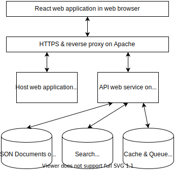

# Pairing Omics Data Platform

Linking mas spectra and genomic information to discover new chemistry.

* Links MS/MS mass spectra with genome, sample preparation, extraction method and instrumentation method
* Links biosynthetic gene cluster with MS^2 mass spectra

A web application for storing paired omics data projects.

The [JSON schema (app/public/schema.json)](app/public/schema.json) describes the format of an project.

[](https://github.com/iomega/paired-data-form/actions?query=workflow%3A%22CI%22CI)
[](https://sonarcloud.io/dashboard?id=iomega_paired-data-form)
[](https://sonarcloud.io/dashboard?id=iomega_paired-data-form)
[](https://bestpractices.coreinfrastructure.org/projects/3757)
[](https://doi.org/10.5281/zenodo.2656630)

## Documentation

Developer, admin and system operator manuals can be found in [manuals/](manuals/) directory.

## Contributing

If you want to contribute to the platform, have a look at the [contribution guidelines](CONTRIBUTING.md).

## Architecture

The Pairing Omics Data Platform consists of:

1. A Web application, user interface, see [app/](app/) directory
2. An API web service, service responsible for storing projects, see [api.](api/) directory

[](app/src/pages/methods/architecture.svg)

The platform is implemented using Javascript based web service and a React (v16.13.1) based web application. The web application renders the submission form from the JSON schema. The web service stores each project as a file on disk. The application offers full text search functionality via web services using an elastic search (v7.6.2) index. The web service uses a redis queue (v5.0.5) to schedule jobs to fetch more information about the public identifiers and to upload the projects to Zenodo each month. For example, the scientific species name is fetched from GenBank using the public genome identifiers in the project. The web service has an OpenAPI (v3.0.3) specification ([https://www.openapis.org/](https://www.openapis.org/)) which can be used to submit and retrieve projects in a programmatic manner. The platform runs using Docker Compose (v1.25.4) with containers for the web application, web service and redis queue.

## Run using Docker compose

The application can be configured using environment variables:

* PORT, http port application is running on. Default is 8443.
* SHARED_TOKEN, token required to login to review area.
* ZENODO_ACCESS_TOKEN, Zenodo access token used for uploading database to Zenodo.
* ZENODO_DEPOSITION_ID, Zenodo deposition identifier used for uploading database to Zenodo. Set to -1 to disable scheduled uploading.
* SLACK_TOKEN, Token of Slack app with chat:write permission in workspace of channel
* SLACK_CHANNEL, Slack channel in which service should post messages

The environment variables can be set in the terminal or be put in a `.env` file.

```shell
docker-compose up -d --build
```

Starts application, api webservice and reverse proxy on [http://localhost:8443](http://localhost:8443).
Project JSON files are stored in a `./data/` directory.

To run on production put application behind a reverse proxy web server with a proper domain and secure transfer with https.

## New release

This chapter is for developers of the platform.

To make a new release of the platform do:

1. Determine new version of release, using semantic versioning (x.y.z)
2. Add version to [CHANGELOG.md](CHANGELOG.md)
    * Create a new `##` chapter for the new version
    * Update version links at bottom of CHANGELOG
3. Set new version of api web service by

    ```shell
    cd api
    npm version x.y.z
    ```

4. Set new version of web application by

    ```shell
    cd app
    npm version x.y.z
    ```

5. Commit & push changes
6. Create a GitHub release
7. On [https://doi.org/10.5281/zenodo.2656630](https://doi.org/10.5281/zenodo.2656630)
    * Update author list
    * Add `https://doi.org/10.5281/zenodo.3736430`, `is compiled/create by this upload` as `Dataset` in related identifiers section.
